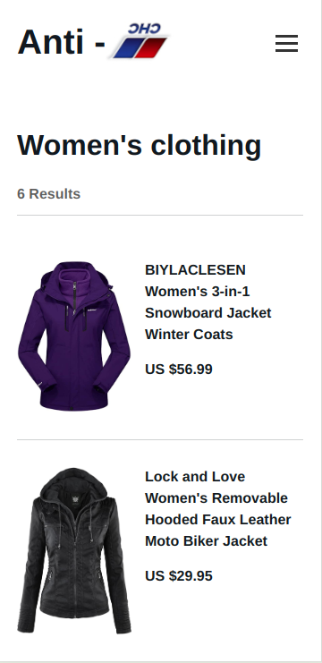
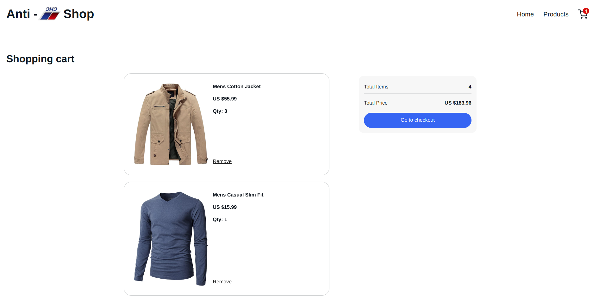

# Shopping Cart Application

## Introduction

The **Shopping Cart Application** is a dynamic and user-friendly React-based project designed to reinforce key front-end development concepts. It provides a smooth shopping experience, allowing users to browse products, add items to their cart, and manage quantities seamlessly.

## Screenshots

- **Mobile View**  
  

- **Desktop View**  
  

## Live Demo

You can view the live project by visiting the following URL:  
[Anti-SNS Shop](https://anti-sns-shop.netlify.app/)

## Assignment Requirements

[Project: Shopping Cart](https://www.theodinproject.com/lessons/node-path-react-new-shopping-cart)

## Features

1. **React Project Setup**

   - Built using React with hooks (`useState`, `useEffect`, and `useContext`) for efficient state management.
   - Modular component-based architecture.

2. **Navigation and Routing**

   - Four primary pages:
     - **Home Page:** Displays introductory content or additional information.
     - **Products Page:** Features the product catalog.
     - **Cart Page:** Features the shopping cart functionality.
     - **Checkout Page:** Features the checkout functionality (still WIP).
   - Navigation bar for smooth transitions between pages.

3. **Shopping Cart Functionality**

   - Display the total number of items in the cart on the navigation bar.
   - Product cards with essential features:
     - Title and product details.
     - Input field to manually enter the desired quantity.
     - Increment and decrement buttons for fine-tuning.
     - "Add to Cart" button for submitting the order.
   - Dynamic cart management, automatically updating the cart total.
   - **Persist cart items in localStorage and sync state updates** to maintain cart data across page reloads.

4. **External API Integration**

   - Fetch product data from [**FakeStore API**](https://fakestoreapi.com/).

5. **Form and Prop Handling**

   - Comprehensive prop validation and clean component communication.

6. **Testing**

   - Thorough testing using the **React Testing Library** (still WIP).
   - Avoid direct testing of external libraries such as `react-router-dom`.

7. **Styling**

   - Visually appealing and responsive design using CSS or preferred CSS frameworks.

8. **Deployment**
   - Hosted on **Netlify** with SPA-friendly routing configuration.

## Possible Enhancements

- Create a **generic component** to handle both **ProductDetails** and **CartItem** components, reducing redundancy.
- **Write additional tests** to improve test coverage and ensure application robustness.

## License

This project is licensed under the Beerware License. For more details about the terms and conditions of this license, refer to the official documentation: [Beerware License](https://people.freebsd.org/~phk/).

## Author

Created by : [Stefan Ljiljak](https://www.linkedin.com/in/stefan-ljiljak/). Feel free to reach out for any suggestions or questions!
